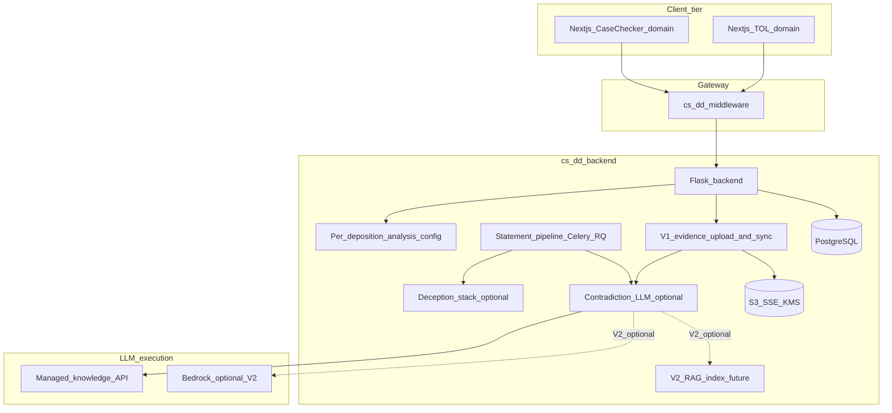

<div align="right"><b><a href="README.md">[Home]</a></b></div>

# Deposition documents and LLM-based contradiction analysis (CaseChecker)

**Status:** Proposal / design specification — **not implemented**. This document describes a planned product capability and integration approach; behavior described here is not guaranteed to match future code.

**Last updated:** April 9, 2026, 1:05:15 PM Eastern Time (EDT; `America/New_York`)

**Product framing:** **Contradiction analysis** is an **optional analysis mode** on the **same online and offline deposition flows** you already have: the user either **uploads a recording** (offline-style) or **has the meeting bot join** for **live** analysis (Recall / online). From there they choose **truth/lie (deception) analysis**, **contradiction analysis**, or **both**. The standalone offering **CaseChecker** (e.g. marketed at `casechecker.ai`) is the **same application and codebase**, configured to default to **contradiction-only** and a CaseChecker-branded UX; **TruthOrLie.ai** keeps full product positioning with optional add-on contradiction. Implementation extends **cs-dd-backend**, **cs-dd-middleware**, and **cs-dd-nextjs-web** with **updated existing APIs** where possible and **new APIs only where necessary** (principally **evidence upload and knowledge sync**).

---

## 1. Executive summary

### 1.1 Problem

Legal teams often possess **case materials** tied to a deposition: exhibits, prior statements, bills, photos, medical records, and similar documents. Today, the platform focuses on **deception-oriented signals** from video, audio, and transcript. A complementary capability is to surface **potential contradictions** between **what is said in testimony** (live or recorded) and **what appears in those uploaded materials**.

### 1.2 Analysis modes (core product model)

| Mode | User-visible name (example) | Requires evidence docs? | Uses existing deception stack? |
|------|-----------------------------|-------------------------|--------------------------------|
| **Deception only** | Truth/lie (current default) | No | Yes (`perform_detection_analysis` / deception services) |
| **Contradiction only** | CaseChecker | Yes (uploaded case evidence) | No |
| **Both** | Truth/lie + CaseChecker | Yes for contradiction branch | Yes for deception branch |

Rules of thumb:

- If **contradiction** is enabled, the user must be able to **upload evidence** (or the flow blocks with a clear UX message) before contradiction jobs run.
- **Deception** and **contradiction** branches should be **independent** where possible: one can fail or be disabled without killing the other (subject to product policy).

### 1.3 Intended outcomes

- Keep **one deposition lifecycle** for online and offline; add **per-request analysis configuration** instead of a parallel product backend.
- Allow **authenticated clients** to attach **evidence documents** to a **specific deposition** (`deposition_id`), scoped by existing session/deposition authorization.
- **V1:** Store evidence in **our S3**, sync files into the **managed knowledge / retrieval provider** (ChatGPT-style APIs); **the provider** performs parsing, chunking, and retrieval over those files. We **orchestrate** calls and persist **citations + findings**—we do **not** build a first-party OCR/chunking/vector pipeline for evidence.
- **V2 (later):** Own the full **RAG** stack (e.g. Textract, embeddings, vector store, hybrid search, Bedrock or self-hosted inference) for maximum control and enterprise tuning.
- **Retrieval / LLM implementation strategy:**
  - **V1: Managed knowledge-base workflow (ChatGPT-style via API)** for fastest delivery and lower operational complexity.
  - **V2: AWS-native RAG** for tighter control, performance tuning, and enterprise hardening at scale.
- **Offline:** Same `run_offline_analysis` pipeline; if contradiction is enabled, run **batch** contradiction passes over transcript windows (and optional post-pass).
- **Online:** Same Celery `process_statement` / `statement_processing` path; if contradiction is enabled, run **per-statement** contradiction after eligible answers (and optional post-session batch after conclude/drain).
- **CaseChecker:** Same APIs and workers; **UI and defaults** differ (contradiction-only, branding, simplified navigation) based on **host / feature flags / account plan**.

### 1.4 Output shape (illustrative)

Structured findings suitable for UI and attorney review, for example:

| Field | Purpose |
|--------|---------|
| `deposition_id` | Scope |
| `seqId` | Links to existing transcript / statement row |
| `transcript_excerpt` | Quoted or referenced testimony |
| `document_id` | Internal id of source file |
| `citation` | Page, section, or chunk offset in source |
| `document_excerpt` | Passage supporting the finding |
| `relationship` | e.g. `contradicts`, `tension`, `omission_suggested` |
| `confidence` | Model or calibrated score |
| `rationale` | Short explanation |
| `requires_human_review` | Always `true` for v1 |
| `analysis_kind` | `contradiction` (and distinct from any parallel deception payload on the same `seqId`) |

### 1.5 Legal and product disclaimers

- This feature is **assistive technology**, not legal advice.
- **False positives and false negatives** are expected; attorneys must validate every finding.
- Contradiction detection is **probabilistic**; edge cases include ambiguous wording, context-dependent meanings, and errors in OCR or transcript alignment.

### 1.6 On “100% safe” and confidentiality

**No real-world information system can honestly promise absolute safety.** The goal of this design is a **defensible, enterprise-appropriate** posture: encryption, network isolation, contractual controls with vendors, minimal retention, strong access control, and auditability—consistent with how we describe the broader platform in [Security Architecture Overview](security-architecture-overview.md) and [Security Overview](security-overview.md). Law firms typically evaluate **subprocessors**, **data residency**, **DPAs/BAAs** (where applicable), and **technical controls**; this spec outlines those dimensions for the document + LLM path.

### 1.7 V1 vs V2: canonical scope boundary (read this first)

Use this table when planning sprints: **V1 is the only target for initial delivery.** V2 is explicitly **out of scope** for that work unless a row is labeled shared.

| Topic | **V1 (ChatGPT-style / managed knowledge)** — we build | **V1** — we do *not* build (defer to provider or V2) | **V2 (AWS RAG / first-party index)** — future |
|--------|--------------------------------------------------------|------------------------------------------------------|-----------------------------------------------|
| **Evidence files** | Register metadata, presigned upload to **S3**, optional virus/MIME checks, list/delete | First-party **PDF/DOCX text extraction**, **OCR** (`ocr_manager`, Textract), layout tables | Textract / Unstructured / custom parsers; quality SLAs we control |
| **Index & retrieval** | Call provider APIs to **attach/sync** files to a per-deposition workspace; query with statement/window | Our own **embeddings**, **chunking strategy**, **vector DB**, **hybrid BM25+vector** tuning | pgvector / OpenSearch / Bedrock Knowledge Bases; custom chunk/rank pipeline |
| **Contradiction LLM** | Prompts, structured JSON, citation validation against **provider-returned** source spans | — | Optionally move inference to **Bedrock** (or keep provider LLM but our index) |
| **Transcript** | Reuse existing online/offline transcript pipeline (Recall / STT path) | — | Same; not replaced by V2 |
| **Deception** | Unchanged when `analysis.deception` | — | Same |
| **Storage layout** | S3 originals + Postgres metadata; optional tiny cache only | Maintaining **`case_documents_extracted/`** and **`case_index/`** as *our* source of truth for search | Local/owned extracted text + vector index artifacts |
| **APIs / UI** | `analysis.*` flags, evidence APIs, updates payloads, CaseChecker host | — | Same contracts; swap `knowledge_base_service` implementation |

**Wording note:** “**Ingestion**” in this spec means **first-party document processing** (parse, OCR, chunk, embed in *our* systems). **V1 does not include that for evidence.** V1 only does **upload + sync to provider**; the provider’s product performs the equivalent of ingestion internally. If scans OCR poorly in V1, mitigation is **provider-side** or **user uploads searchable PDFs** until V2.

**V2 “not something to worry about for V1”:** No Bedrock Knowledge Bases, no Textract for evidence, no embedding pipeline, no OpenSearch/pgvector for case evidence, no custom chunk overlap tuning for RAG—in the V1 milestone. Those rows are planning-only until migration triggers in **section 4.6** fire.

---

## 2. Architectural overview

### 2.0 Unified user journey (same flows, optional analysis branches)

**Offline (uploaded media):** unchanged entry concept — user uploads a recording and starts analysis via existing **initiate offline** flow ([initiate-offline-analysis](api-endpoints/initiate-offline-analysis.md) on middleware). Payload gains **which analyses to run** (deception, contradiction, or both). If contradiction is on, user must attach **evidence** (before or after initiate per UX), backend syncs evidence into the knowledge layer, then transcript pipeline runs as today with an added contradiction branch.

**Online (live / bot):** unchanged entry concept — user starts **online** analysis and the **Recall bot** joins ([initiate-online-analysis](api-endpoints/initiate-online-analysis.md)). Same **analysis mode** flags. Evidence upload can happen before go-live or during session depending on product rules; backend must not run contradiction until evidence is indexed (or must degrade gracefully).

**CaseChecker-only:** same backend and middleware contracts; **default** `analysis.contradiction=true` and `analysis.deception=false`, and **nextjs** uses host/config (e.g. `casechecker.ai`) to show contradiction-first UI and hide deception affordances unless a plan flag re-enables them.

### 2.1 System context



### 2.2 V1 architecture: managed knowledge-base workflow (ChatGPT-style)

See **section 1.7** for the authoritative V1 vs V2 split. V1 uses a **managed** knowledge retrieval approach: **we do not run a first-party RAG ingestion pipeline** for evidence.

Implementation note:

- ChatGPT UI **Projects** are not the same as a product API object.
- For product implementation, use API-managed equivalents (file uploads + retrieval tool/vector store + responses) to reproduce the same behavior in backend services.

V1 flow:

1. **Our platform:** user uploads evidence; we store bytes in **S3** and metadata in **Postgres**; we **sync** files into the provider’s workspace for this `deposition_id`.
2. **Provider (not our sprint work):** parsing, chunking, indexing, and retrieval over those files.
3. **Our platform:** on each transcript statement (or window), call the provider to retrieve relevant evidence context and run the **contradiction** prompt.
4. **Our platform:** validate citations against returned source spans; persist findings; expose via existing update/status APIs.

**When to use:** V1 production launch with limited ops headcount and rapid iteration goals.  
**Tradeoff:** less control than V2 custom RAG over retrieval internals, OCR quality, ranking, and index lifecycle.

### 2.3 Logical components by phase

#### 2.3.1 V1 — platform components (build these)

| Component | Role |
|-----------|------|
| **Evidence APIs** | Register file metadata, **presigned S3 upload**, list/delete; optional MIME/size limits and malware scan **before** sync only. |
| **Evidence storage** | **S3** originals + **Postgres** row per file (`deposition_id`, hash, name, uploader, sync state). |
| **Knowledge sync** | Backend calls provider SDK/API to **attach or refresh** files in the deposition-scoped workspace; track **ready / indexing / error** for gating contradiction jobs. |
| **Contradiction orchestration** | Celery/RQ hooks gated on `analysis.contradiction` + **sync-ready**; batch + per-statement job shapes. |
| **Contradiction engine (app layer)** | Prompt templates, structured JSON output, citation validation, dedupe, persistence to `contradiction_findings`. |
| **API/UI extensions** | `analysis.*` on initiate; contradiction fields on **get-online-analysis-updates** / **get-statuses**; CaseChecker host defaults. |

#### 2.3.2 V2 — additional platform components (future; not V1)

| Component | Role |
|-----------|------|
| **First-party ingestion** | PDF/DOCX parse, **OCR** (e.g. Textract), table/layout handling, canonical extracted text with page provenance **in our systems**. |
| **Chunking & embeddings** | Our chunk strategy, embedding model choice, overlap, metadata (page, section). |
| **Vector index + hybrid search** | pgvector / OpenSearch / Bedrock Knowledge Bases; lexical + semantic tuning. |
| **Inference hosting** | Optional **Bedrock** (or other) for LLM; VPC endpoints, CloudTrail-heavy ops model. |
| **Local artifact dirs** | e.g. `case_documents_extracted/`, `case_index/` under `LOCAL_STORE_ROOT` as **our** retrieval source of truth—not required for V1 if the provider holds the index. |

### 2.4 Online vs offline vs post-online

| Mode | Trigger | Inputs (typical) | Latency goal |
|------|---------|------------------|--------------|
| **Online** | After each finalized **answer** (configurable) in the Celery statement pipeline | Statement text, `seqId`, top-k retrieved chunks, optional rolling Q/A window | Low enough for “live assist”; may be async in UI (show when ready) |
| **Offline** | After transcript + deception pipeline completes in `run_offline_analysis` | Full or windowed transcript, retrieval per segment or global, merged/deduped findings | Batch; minutes to hours acceptable |
| **Post-online** | After **conclude** / Celery drain (see [`ONLINE_FLOW.md`](https://github.com/courtscribesinc-org/cs-dd-backend/blob/development/ONLINE_FLOW.md) wrap-up section in cs-dd-backend) | Full session transcript + expanded retrieval | Same as offline-style batch |

**Mapping to cs-dd-backend (conceptual):**

- **Persisted config:** When a deposition is initiated (online or offline), store **`analysis.deception`** and **`analysis.contradiction`** (or equivalent) on the deposition record or in the existing payload handoff so workers can branch without re-deriving intent from the client on every statement.
- **Online:** [`celery_tasks.process_statement`](https://github.com/courtscribesinc-org/cs-dd-backend/blob/development/celery_tasks.py) → [`statement_processing.statement_processing`](https://github.com/courtscribesinc-org/cs-dd-backend/blob/development/statement_processing.py) ([`ONLINE_FLOW.md`](https://github.com/courtscribesinc-org/cs-dd-backend/blob/development/ONLINE_FLOW.md)):
  - If **`analysis.deception`**: existing `perform_detection_analysis` path unchanged.
  - If **`analysis.contradiction`**: enqueue or inline **contradiction** step for eligible answers (after or parallel to deception, per product policy), only when evidence index is ready.
- **Offline:** [`offline/utils.py` — `run_offline_analysis`](https://github.com/courtscribesinc-org/cs-dd-backend/blob/development/offline/utils.py) ([`OFFLINE_FLOW.md`](https://github.com/courtscribesinc-org/cs-dd-backend/blob/development/OFFLINE_FLOW.md)):
  - If **`analysis.deception`**: existing `perform_deception_analysis` unchanged.
  - If **`analysis.contradiction`**: add **batch contradiction** stage (windowed transcript + retrieval) and optional second pass.
- **Post-online:** If **`analysis.contradiction`**, hook conclude / `check_jobs` / upload-prep to enqueue **second-pass** contradiction job when evidence exists.

### 2.5 V1 data flow (managed knowledge retrieval)

What **we** operate vs the **provider** (see section 1.7):

| Step | Owner | Action |
|------|--------|--------|
| 1 | **Platform** | Presigned upload → **S3**; metadata in **Postgres**. |
| 2 | **Platform** | **Sync** file references into provider workspace per `deposition_id`; poll until **ready** (or surface error). |
| 3 | **Provider** | Internal parse/chunk/index (not implemented in our repo for V1). |
| 4 | **Platform** | Transcript events: per-statement (online) or windows (offline/post). |
| 5 | **Platform + provider API** | Request retrieval + contradiction completion using **our** prompts/schemas. |
| 6 | **Platform** | Citation validation, persist findings, serve via existing update/status APIs. |

### 2.6 V2 data flow (AWS-native RAG) — future

V2 **replaces step 3** with **our** extraction + chunk + embed + index pipeline, and may move LLM inference to **Bedrock** (or keep external LLM but still use our index).

Recommended AWS services in V2:

- **Amazon S3** + **KMS** for storage/encryption.
- **Amazon Textract** for OCR/extraction.
- **Bedrock Knowledge Bases** or custom vector retrieval on **OpenSearch/pgvector**.
- **Bedrock models** for contradiction inference.
- Optional **Lambda/SQS** for decoupled ingestion and analysis orchestration.

Migration intent: preserve prompt/output contract so V1 and V2 can share the same contradiction schema and UI behavior.

---

## 3. Security and trust (detailed)

This section aligns with the **defense-in-depth** narrative in [Security Architecture Overview](security-architecture-overview.md): tiered network isolation, TLS, KMS, and deposition-scoped access control.

### 3.1 Data lifecycle

| Phase | Control |
|-------|---------|
| **At rest** | S3 **SSE-KMS**; RDS encryption; no secrets in source control (see cs-dd-backend `SECURITY.md` / `secrets_config.py` patterns). |
| **In transit** | **TLS 1.2+** for all external and internal HTTP; for LLM APIs prefer **private connectivity** (VPC endpoints, Azure Private Link, etc.) where offered. |
| **Processing** | Ephemeral memory on workers; avoid writing full document text to unstructured logs. |
| **Retention** | **Deposition-scoped** retention policy; explicit delete on case close; optional **legal hold** that blocks deletion. |
| **Disposal** | Secure delete of S3 objects, index entries, and DB rows per policy; re-index or purge embeddings when documents removed. |

### 3.2 LLM provider tiers (choose per customer / contract)

**V1 default:** tier **1** (managed API with enterprise agreements) for both **knowledge workspace** and **contradiction LLM**, unless you explicitly standardize on one vendor for both.

**V2 emphasis:** tier **2** (Bedrock + AWS RAG stack) becomes the natural home for **index + inference** when you migrate off provider-hosted retrieval.

Document **all three** in sales and security questionnaires; implementation can be feature-flagged per environment, plan, or host (e.g. CaseChecker vs TruthOrLie).

1. **Managed API (OpenAI, Anthropic, Google, others) — Enterprise programs**  
   - Written **DPA** and, where required, **BAA** (or equivalent).  
   - **No training** on customer data (contractual).  
   - **Zero retention** / no logging of prompts and completions for model improvement (verify exact terms at contract time).  
   - **Regional** deployment / data residency if offered.

2. **AWS-native — Amazon Bedrock** (**primary for V2 RAG / optional V2 inference**)  
   - Traffic over **VPC endpoints** (no public internet to provider edge where configured).  
   - **KMS** for encryption; **IAM** least privilege; **CloudTrail** for API audit.  
   - Fits existing **AWS-centric** deployment described in the [technical docs README](README.md).
   - **Not a V1 requirement:** Bedrock Knowledge Bases and Textract pipelines are **out of scope** until V2 (section 1.7).

3. **Self-hosted (maximum isolation)**  
   - Model weights and inference **only** inside customer-dedicated VPC or on-prem.  
   - **No third-party inference** of deposition content.  
   - Higher **ops cost**, **GPU capacity planning**, and responsibility for **patching** and **availability**.

**Reality check:** Even tier 3 does not remove all risk (insider threat, misconfiguration, supply chain). The product should communicate **residual risk** clearly in enterprise agreements.

### 3.3 Application-level controls

- **Scoping:** Server-side enforcement: retrieval and LLM context **only** include evidence for the **same `deposition_id`** as the analysis session.
- **Prompt injection:** Treat uploaded text and retrieved chunks as **untrusted**; use clear delimiter patterns, system vs user roles where the API supports them. **V1:** file-type validation and malware scan **before** sync; **V2:** add sandboxed format conversion in **our** ingestion pipeline when applicable.
- **Logging:** **Redact** or **hash** document excerpts in application logs; log **event types** and **ids** for audit (“contradiction job ran for deposition X”) without full content.
- **RBAC / ABAC:** Upload, list, download, and “view findings” permissions should mirror existing **frontend + middleware** authorization patterns; backend trusts only **authenticated** service or user context from middleware.
- **Grounding enforcement:** reject contradiction outputs that do not include citations mapping to retrieved chunk/document metadata.

### 3.4 Security controls specific to V1 managed-knowledge path

- S3 bucket policies scoped to service roles and deposition namespaces.
- Encryption and key management for stored source artifacts and logs.
- Per-deposition logical isolation in metadata and retrieval filters (and per-account if you add org-level boundaries later).
- Retention controls for:
  - raw uploaded documents,
  - managed knowledge artifacts (parsed/indexed content),
  - contradiction outputs.
- Explicit subprocessor disclosure for model providers and managed retrieval stack.
- Document that managed retrieval layer may still consume tokens/compute during retrieval and response generation.

### 3.5 Security controls specific to V2 AWS-native RAG path

- KMS CMKs with strict IAM key policies and key usage logging.
- Private service connectivity where feasible (VPC endpoints/PrivateLink).
- CloudTrail logging for Bedrock/Textract/KMS API activity.
- Explicit controls for vector index tenancy, index deletion, and re-index procedures.

### 3.6 Compliance narrative for law firms

- Maintain an accurate **subprocessor list** (cloud, LLM vendor, embedding APIs, antivirus SaaS).  
- Offer **data residency** choices where technically feasible.  
- Tie roadmap to organizational controls (e.g. [SOC 2 readiness](soc2-readiness-checklist.md), penetration testing cadence) as documented elsewhere.

---

## 4. Models, hosting, and hardware

**Validate model names, context windows, and enterprise terms at implementation time**—the market moves quickly.

**Section applicability:** Subsections **4.1–4.3** (criteria, model tiers, prompts, token tips) apply to **V1 and V2** at the *application* layer (what you ask the model, how you budget tokens). Subsections **4.4** and **4.5–4.6** split **where code runs**: **4.4** is mostly **V2 / future ops** (Bedrock, extra ASGs for OCR); **V1** assumes existing backend workers + **external** managed APIs without new AWS ML infrastructure.

### 4.1 Selection criteria

- **Long context** for batch and post-online passes (full transcript + excerpts).  
- **Strong reasoning** for nuanced distinctions: direct contradiction vs. ambiguous wording vs. missing context.  
- **Structured output** (JSON schema, tool use, or equivalent) for reliable parsing.  
- **Latency and cost** tradeoffs for online per-statement calls.

### 4.2 Recommended defaults (starting point)

| Use case | Suggested class | Notes |
|----------|-----------------|--------|
| **Batch / post-online** | Large-context **frontier-class** general model (e.g. Claude Sonnet–class, GPT-4.1 / GPT-4o–class, or Gemini Pro–class with sufficient context) | One or few calls over chunked transcript + retrieval |
| **Online per-statement** | **Smaller / faster** model from same vendor family, or same model with **tighter** context (retrieval-only) | Rate-limit per deposition |
| **Escalation** | Optional **reasoning**-optimized model for low-confidence or high-stakes flags only | Cost control |

### 4.2.1 Model trial sequence (to avoid overpaying)

1. **Fast triage model first** for online per-statement contradiction checks.
2. **Higher-quality model second** for:
   - low-confidence triage outputs,
   - high-stakes statements,
   - post-session reconciliation.
3. **Escalation model** only when contradiction confidence and retrieval confidence disagree.

Recommended evaluation harness:

- Holdout set of deposition statements + known contradiction labels.
- Measure precision/recall, citation validity rate, latency, and cost per 1,000 statements.
- Choose baseline model based on **best quality-per-dollar**, not absolute model quality.

### 4.2.2 Prompt templates (production candidates)

System prompt (online triage):

```text
You are a legal fact-checking assistant. Compare the live statement against ONLY the provided evidence excerpts.
Return strict JSON.
Rules:
1) Do not use external knowledge.
2) If evidence is insufficient, return "insufficient_evidence".
3) Every contradiction must cite evidence_chunk_ids and source references.
4) Never fabricate citations.
```

User prompt (online triage):

```text
deposition_id: {{deposition_id}}
seq_id: {{seq_id}}
statement_text: {{statement_text}}
speaker_role: {{speaker_role}}

Evidence excerpts:
{{retrieved_chunks_with_ids_and_source_refs}}

Return JSON:
{
  "result": "contradiction" | "no_contradiction" | "insufficient_evidence",
  "confidence": "high" | "medium" | "low",
  "findings": [
    {
      "summary": "...",
      "statement_span": "...",
      "evidence_chunk_ids": ["..."],
      "sources": [{"document_id":"...","page":"...","quote":"..."}]
    }
  ]
}
```

Batch/post-session prompt add-on:

```text
You are processing transcript windows. Detect contradictions with the provided evidence.
Prefer precision over recall. Do not repeat prior findings if semantically equivalent.
```

### 4.2.3 Token and cost minimization strategy

- Retrieval-first: send only top-k reranked evidence chunks (**V2:** we control chunking; **V1:** use provider parameters / prompt limits to cap how much evidence enters each call).
- **V2 tuning:** compact chunk size with overlap tuned for citation fidelity (not a V1 engineering deliverable).
- Trim transcript context to relevant speaker turn + short window.
- Cache retrieval results and duplicate statement hashes.
- Run low-cost model for first pass; escalate only selective cases.
- Enforce max tokens and strict JSON output to reduce verbose responses.
- Batch offline windows and parallelize carefully within budget caps.
- For managed knowledge V1, track per-request token usage and retrieval hit rates; do not assume uploaded files make query-time cost zero.

### 4.3 Self-hosted baseline

- **Llama 3.1 70B** (or equivalent open-weights) as a **reference** for organizations that forbid external inference.  
- **Order-of-magnitude hardware:** quantized 70B inference often requires **tens of GB VRAM** per concurrent stream; comfortable multi-tenant throughput typically targets **80GB-class GPUs** (e.g. A100/H100) or multiple smaller GPUs with batching—**exact sizing requires a PoC** with your expected tokens/sec and concurrency.

### 4.4 Where to run

**V1 (now):**

- Run contradiction orchestration on **existing** cs-dd-backend worker topology (**Celery** / **RQ**); no new GPU pool for evidence.
- Call **managed** knowledge + LLM APIs from those workers; scale concurrency with existing patterns.
- **Do not** block V1 on Bedrock, Textract ASGs, or vector clusters.

**V2 (later):**

- **Bedrock** (and/or Azure OpenAI private) for **owned** index + inference if you migrate.
- **Dedicated ASG** (optional): CPU-heavy **ingest/OCR** workers separate from GPU **deception** hosts so Textract/RAG prep does not starve `deception_service` / `gpu_service` ([`REPO_CONTEXT.md`](https://github.com/courtscribesinc-org/cs-dd-backend/blob/development/REPO_CONTEXT.md) snapshot).
- **Concurrency:** same Redis queues; add **per-deposition** rate limits for embedding/batch jobs when V2 exists.

### 4.5 Architecture options by phase

1. **V1 default: managed knowledge-base workflow (ChatGPT-style via API tools)**  
   Use for fastest time-to-value. **No first-party RAG ingestion** (section 1.7).

2. **V2 default: AWS-native RAG** (S3 + Textract + Bedrock/OpenSearch/pgvector)  
   Use when you need deeper control over chunking, ranking, security boundaries, and long-run performance/cost tuning.

3. **DIY RAG (provider-agnostic)**  
   Use when you need portability across model vendors or custom retrieval/ranking beyond managed options.

### 4.6 V1 -> V2 migration triggers

Move from V1 managed knowledge to V2 AWS-native RAG when one or more are true:

- Persistent cost inefficiency from managed retrieval vs controlled in-house retrieval.
- Need for retrieval customization (chunking/reranking/filter logic) not exposed by V1 tools.
- Enterprise security/procurement requires stricter platform ownership of indexing stack.
- Latency or throughput requirements exceed V1 managed service behavior.
- Need for deterministic re-index/versioning controls across many large matters.

---

## 5. Integration with existing codebase and APIs

Implementation is **future work**. Contradiction analysis is **not** a separate backend product: it extends the **same** online/offline initiation, transcript processing, and results surfaces you already operate.

### 5.1 Pipeline integration (cs-dd-backend)

| Area | Integration idea |
|------|------------------|
| **Deposition config** | Persist `analysis.deception` / `analysis.contradiction` (and optional post-pass flags) when analysis starts; workers read this on every statement/job. |
| **Online pipeline** | In `statement_processing.py`, gate existing deception work on `analysis.deception`; gate contradiction work on `analysis.contradiction` and **evidence index readiness**. |
| **Offline pipeline** | In `offline/utils.py` `run_offline_analysis`, same gating: run deception stages only if enabled; run contradiction batch only if enabled. |
| **Post-online** | On conclude / drain, enqueue optional contradiction second-pass if `analysis.contradiction` and evidence exist. |
| **Filesystem** | **V1:** `case_documents/` (or equivalent) for **S3-backed** originals is enough if sync goes straight to provider; **avoid** building `case_documents_extracted/` and `case_index/` as required paths until **V2** (section 2.3.2). |
| **Database** | **V1:** evidence metadata, sync state, `contradiction_findings`; chunk pointers **optional** and usually **provider-side** only. **V2:** add explicit chunk/embedding tables or index pointers as needed. |
| **Secrets** | `secrets_config.py` (or successor): managed-knowledge / LLM keys, optional Bedrock ARNs for V2—**never** committed. |
| **Observability** | Loguru `area=` tags ([`LOGGING.md`](https://github.com/courtscribesinc-org/cs-dd-backend/blob/development/LOGGING.md)); metrics for contradiction latency/tokens alongside existing `stats.csv` patterns. |

### 5.2 API strategy: extend existing middleware contracts first

Documented middleware entry points today include (see [README — API Endpoints](README.md#api-endpoints)):

| Existing API | Intended change |
|--------------|-----------------|
| [initiate-offline-analysis](api-endpoints/initiate-offline-analysis.md) | Add **`analysis`** (or equivalent) object: `{ "deception": bool, "contradiction": bool }` and optional **`evidence`** handles if uploads complete before initiate. |
| [initiate-online-analysis](api-endpoints/initiate-online-analysis.md) | Same **`analysis`** flags; ensure capacity checks account for contradiction workload if enabled. |
| [get-statuses](api-endpoints/get-statuses.md) | Include contradiction phase state (e.g. evidence indexing, batch job id, error) alongside existing status fields. |
| [get-online-analysis-updates](api-endpoints/get-online-analysis-updates.md) | Return **contradiction findings** (or the same payload fragments that will be written into `transcript.json`) **per `seqId`** in the same polling model the UI already uses for online results. **No separate `GET .../contradictions` route is required** for the product client if this payload is sufficient. |
| [conclude-online-analysis](api-endpoints/conclude-online-analysis.md) | Optionally trigger **post-session contradiction** pass when configured. |
| [analysis-status webhook](api-endpoints/analysis-status-webhook.md) (frontend) | Extend payload or parallel webhook if needed so CaseChecker/TOL UI can show contradiction milestones without new polling patterns (minimize if one channel suffices). |

**New APIs (add only as needed):** evidence lifecycle is the main gap today. Prefer **one small family** of routes (middleware exposes, backend implements), for example:

- `POST .../deposition/{id}/evidence/register` — register files, return presigned upload URLs  
- `POST .../deposition/{id}/evidence/sync` — kick knowledge-base sync after upload  
- `GET .../deposition/{id}/evidence` — list uploaded evidence and index status  
- `DELETE .../deposition/{id}/evidence/{document_id}` — remove and re-index  

Exact paths should follow your existing middleware URL conventions; the important part is **narrow new surface**: clients should not need a separate “start CaseChecker” API if **initiate** + **analysis flags** already express intent.

**No public `POST .../contradictions/analyze` or `GET .../contradictions` for V1:** Contradiction work is **scheduled by the existing pipeline** (Celery per statement, RQ batch offline, post-conclude jobs). Workers call an **internal service layer** (Python), not a new REST resource, to run the provider LLM. **Clients** learn results through **(a)** extended **[get-online-analysis-updates](api-endpoints/get-online-analysis-updates.md) / [get-statuses](api-endpoints/get-statuses.md)** and **(b)** the authoritative **`transcript.json`** artifact written to S3 (and whatever the UI already loads for review). Optional HTTP routes for debugging or admin-only tools are out of scope for the product contract.

### 5.3 UI (cs-dd-nextjs-web): one app, two products

- **Shared components:** evidence upload, transcript view, flag panels, post-session report — implemented once.
- **TruthOrLie.ai:** default `analysis.deception=true`; show contradiction as **optional** upsell or checkbox; show both result types when enabled.
- **CaseChecker (e.g. casechecker.ai):** build flag / host-based config sets default `analysis.contradiction=true`, `analysis.deception=false`; hide deception-specific chrome; allow plan-based enablement of deception later if desired.
- **Dynamic layout:** route-level or feature-flag-driven navigation so the same deployment serves both brands without forking the repo.

### 5.4 Cross-repository responsibilities

| Repo | Responsibility |
|------|----------------|
| **cs-dd-nextjs-web** | Analysis mode selection, evidence upload UX, contradiction findings UI, CaseChecker branding. |
| **cs-dd-middleware** | Extended initiate/status/update payloads; evidence API pass-through; auth. |
| **cs-dd-backend** | Persist analysis flags, **evidence upload + provider sync** (V1), contradiction workers, store findings keyed by `seqId`. |

### 5.5 Suggested backend module boundaries (V1 with V2-compatible abstraction)

- `document_ingest_service` (evidence): **V1** — upload registration, presigned URLs, metadata, optional malware scan; **V2** — add extraction/OCR job orchestration when we own parsing.
- `knowledge_base_service`: **V1** — provider client for workspace sync + query; **V2** — pluggable swap to Bedrock KB / OpenSearch / pgvector with the same seams where feasible.
- `llm_client` (naming illustrative): **`LLMClient` interface**, **vendor adapters** (OpenAI-compatible, Anthropic, etc.), and a **factory** driven by config/env so production can change provider/model without touching `contradiction_service` — see **section 5.7.1**.
- `contradiction_service`: prompt construction, model routing, citation validation.
- `analysis_policy_service`: interpret stored `analysis.*` flags and evidence readiness; centralize gating.
- `cost_control_service`: token accounting, per-deposition budgets.
- `findings_service`: persist and merge online/offline/post-session contradiction outputs; **serialize into `transcript.json`** (and DB) on each update or finalize pass.

### 5.6 Extending `transcript.json` for contradiction (CaseChecker) data

Today, analyzed sessions already produce a **`transcript.json`** artifact for playback and review. **V1 should extend that file in place** (optional root keys such as **`schema_version`**, plus **per-event** fields under **`events`**) so downstream consumers have **one** transcript that can carry **deception scores, contradiction findings, or both**.

#### Production shape today (cs-dd-backend)

The merged backend writes a JSON object with:

| Field | Meaning |
|-------|---------|
| **`completedAt`** | Integer, Unix epoch **milliseconds**, set when the file is saved. |
| **`events`** | Ordered list of transcript segments; **`seqId`** is the stable join key to polling APIs and DB rows. |

Each **`events[]`** object is built for online export in **`generate_transcript`** (`cs-dd-backend/online_upload_results.py`) and includes at least:

- **`seqId`**, **`startTime`**, **`endTime`**, **`text`**, **`sentenceClass`**, **`speaker`**, **`primarySpeaker`**

When **`primarySpeaker`** is true, the same code adds deception fields from the DB row:

- **`deceptionScore`**, **`deceptionDetection`** (object; from stored `deceptionResult`), **`numBars`**

Offline deception scoring patches the same field names onto primary-speaker events in **`perform_deception_analysis`** (`cs-dd-backend/offline/utils.py`) before **`save_transcript`**.

**Persistence:** **`save_transcript`** appears in **`cs-dd-backend/utils/common.py`** (shared helper) and **`cs-dd-backend/offline/utils.py`**; the online upload worker uses **`save_transcript`** in **`cs-dd-backend/online_upload_results.py`** (temp file + **`os.replace`** for an atomic write) before S3 upload. Serialization uses **`json.dump(..., indent=4, sort_keys=True)`**, so **key order in the file is alphabetical**, not insertion order.

**Concrete minimal example:** A real file that matches the core **`events`** shape (here every row has **`primarySpeaker`: false**, so no deception keys) is:

`/Users/ArtThomas/Documents/Fresh Ice Software/truthorlie.ai/Test Videos/interrogation_fail_transcript.json`

Use it as a fixture when validating parsers; do not commit sensitive transcripts into docs repos unless sanitized.

#### Design goals for contradiction (additive)

- **Stable key:** keep **`seqId`** as the join key between **[get-online-analysis-updates](api-endpoints/get-online-analysis-updates.md)** and each **`events[]`** entry.
- **Additive:** older readers ignore unknown keys; new readers can require **`schema_version >= N`** to interpret **`contradiction`** blocks.
- **Idempotent writes:** re-running a post-pass **merges** into the existing **`seqId`** entry (dedupe by **`finding_id`** inside **`events[].contradiction.findings`**).

#### Illustrative V1 extension (on top of production `events`)

Contradiction data should live **on the same objects as today** — inside **`events[]`**, not a parallel **`items`** array. Optional root metadata (version, batch status) can sit beside **`completedAt`** and **`events`**.

```json
{
  "completedAt": 1775084435586,
  "contradiction_batch": {
    "notes": "optional second-pass summary or global-only flags",
    "post_session_pass": "complete"
  },
  "events": [
    {
      "endTime": 30.04,
      "primarySpeaker": false,
      "sentenceClass": "Question",
      "seqId": 0,
      "speaker": "S1",
      "startTime": 0,
      "text": "It's okay."
    },
    {
      "contradiction": {
        "confidence": "high",
        "findings": [
          {
            "citations": [
              {
                "document_id": "doc_001",
                "document_name": "WageStatement_March.pdf",
                "page": 3,
                "provider_file_id": "file-xxx",
                "quote": "Employee logged 24 hours from Jan 20 to Jan 26."
              }
            ],
            "finding_id": "f_1",
            "relationship": "contradicts",
            "requires_human_review": true,
            "summary": "Conflicts with wage record dates.",
            "updated_at": "2026-04-06T19:05:00Z"
          }
        ],
        "result": "contradiction",
        "status": "complete"
      },
      "deceptionDetection": {},
      "deceptionScore": -1,
      "endTime": 120.5,
      "numBars": 0,
      "primarySpeaker": true,
      "sentenceClass": "Answer",
      "seqId": 143,
      "speaker": "S2",
      "startTime": 118.0,
      "text": "I did not work at all after January 12."
    }
  ],
  "schema_version": 2
}
```

The sample above uses **sorted keys** like the production writer; only **`schema_version`**, **`contradiction_batch`**, and per-event **`contradiction`** are new relative to today’s pipeline.

**Offline vs online**

- **Offline:** after **`perform_deception_analysis`** / contradiction batch, regenerate or patch **`transcript.json`** before **`save_results`** uploads to S3 (same bucket/key conventions you use today).
- **Online:** after each contradiction completes for a **`seqId`**, append/update that event’s **`contradiction`** object; on conclude, run post-pass and a final consistent write as part of existing upload/finalize.

**Relationship to polling APIs**

- **[get-online-analysis-updates](api-endpoints/get-online-analysis-updates.md)** should return **the same structured contradiction payload** (or a diff) the UI needs **before** the final S3 write lands, so live sessions feel responsive; **`transcript.json`** remains the **durable** export customers archive.

### 5.7 OpenAI HTTP APIs (V1 provider — backend only)

For **V1 ChatGPT-style / managed knowledge**, the **cs-dd-backend** worker uses **OpenAI’s REST API** (or a compatible vendor). The **browser never calls OpenAI**; only the backend (with server-side API keys and enterprise agreements).

#### 5.7.1 Pluggable LLM client (Adapter + Strategy + Factory)

**Goal:** `contradiction_service`, evidence sync helpers, and any other backend code that needs generative or tool-using calls should depend on a **small, stable interface** (e.g. **`LLMClient`**) — not on a single vendor SDK or hard-coded HTTP paths. **Production** should switch models or providers by **configuration** (and optionally environment overrides), not by branching business logic across the codebase.

**Recommended patterns**

| Pattern | Role |
|---------|------|
| **Strategy** | The **behavior** “how we call an LLM for contradiction (and related tasks)” is selected at runtime: OpenAI-compatible chat, Anthropic Messages, Azure OpenAI, Bedrock, etc., each implementing the same operations the product needs (e.g. **chat completion** with optional **tool / retrieval** hooks as the API allows). |
| **Adapter** | Each vendor (or compatibility layer) gets an **adapter** class that maps **shared** request/response shapes (messages, model id, temperature, max tokens, structured-output hints) onto that vendor’s HTTP or SDK. OpenAI-compatible gateways count as one adapter family; native Anthropic or AWS APIs are separate adapters behind the same interface. |
| **Factory** | A **factory** (or DI entry point) reads **`be_config.json`** (or equivalent) plus env (e.g. **`LLM_PROVIDER`**, API key env vars) and returns the concrete **`LLMClient`**. Workers and services request **`get_llm_client()`** (or inject the interface) once per job or process — they do not instantiate vendor clients directly. |

**Interface sketch (illustrative, not a code contract)**

- **`LLMClient`:** methods aligned to what the product actually needs (e.g. **`complete_chat(messages, …) -> CompletionResult`**; later optional **`upload_file`**, **`attach_to_knowledge_base`**, or **`respond_with_tools`** if those stay vendor-specific, they can live on **capability-specific** interfaces or optional mixins so core contradiction code stays minimal).
- **`CompletionResult`:** normalized **text**, **model**, **usage** (tokens), and optional **raw** payload for logging **request id** / debugging — without leaking full prompts or evidence into logs (see operational notes below).

**Configuration:** Prefer **`provider`** (or **`adapter`**) **+** **`model`** **+** **`base_url`** (where applicable) **+** **`api_key_env`** in config so secrets stay in the environment and **UAT vs production** differ only by config. **V2** (Bedrock KB, etc.) can add new adapter implementations without changing **`contradiction_service`** call sites if the factory maps **`provider`** to the right class.

**Testing:** Provide a **noop / echo** or **fixture** implementation of **`LLMClient`** for unit tests so prompts and merge logic are tested without network or API keys.

The **table below** documents **OpenAI’s HTTP surface** as used by the **OpenAI-compatible adapter** (including official API, Azure OpenAI, and many proxies). Other adapters follow their vendors’ docs; the product code should not special-case them outside the adapter layer.

**Base URL (OpenAI-compatible adapter):** `https://api.openai.com/v1` (or Azure OpenAI / OpenAI-compatible proxy if you standardize on that).

Typical flows (names and fields follow OpenAI’s REST model; **verify paths and request bodies against current official docs** when implementing):

| Step | HTTP method and path (OpenAI) | Purpose |
|------|-------------------------------|---------|
| Upload evidence bytes | `POST /files` (`multipart/form-data`: `file`, `purpose`) | Store each exhibit PDF/DOCX/image for later attachment to retrieval. `purpose` is commonly `assistants` or the value required for your chosen retrieval feature. |
| Create or reuse vector store | `POST /vector_stores` | One **vector store per deposition** (or per “CaseChecker workspace”) holding embeddings for that matter’s files. |
| Attach files to store | `POST /vector_stores/{vector_store_id}/file_batches` (batch of `file_ids`) | Ingest uploaded `file_id`s into the store; poll batch status until **completed** (this is your **“sync ready”** gate). |
| Remove / refresh | `DELETE /vector_stores/{vector_store_id}/files/{file_id}` or new batch | When user deletes evidence in your UI, mirror delete in the store and re-run contradiction only after re-index settles. |
| Run contradiction + retrieval | `POST /responses` with **`tools`** including **`file_search`** and `vector_store_ids: [...]`, **or** the **Chat Completions**-compatible pattern your SDK documents for file search | Send **system + user** messages: instructions (contradiction rubric, JSON-only output), **statement text**, optional Q/A window; model returns structured JSON with citations grounded in retrieved chunks. |
| Optional: standalone chat | `POST /chat/completions` | Only if you split “retrieve” and “answer” into two calls; prefer **one** retrieval-augmented call if the API supports it to save latency. |

**Prompts**

- **System message:** contradiction rules, “no external knowledge,” citation requirements, JSON schema (see section 4.2.2).
- **User message:** `deposition_id`, `seqId`, `statement_text`, and any **rolling context**; do **not** paste full evidence—rely on **file_search** to inject passages.

**Operational notes**

- Log **OpenAI `request_id`**, **model**, **token usage**, and **vector_store_id** / **file_id** in your **internal** logs (not full document text).
- Map OpenAI **`file_id`** into your Postgres **`document_id`** row for citation validation.
- Rate limits and concurrency: reuse your existing worker **per-deposition** throttles.

**If you publish OpenAPI 3.x for *your* middleware/backend:** add schemas only for **extended** initiate/status/update bodies and **evidence** routes; **do not** need to publish OpenAPI for OpenAI’s endpoints—you consume theirs via SDK or hand-written client.

---

## 6. Non-goals, risks, and phased rollout

### 6.1 Non-goals (initial phases)

- Replacing **attorney judgment** or issuing legal conclusions.  
- **Video-only** contradiction (without transcript alignment).  
- Guaranteed **exhaustive** detection of every inconsistency in large corpora.

### 6.2 Risks and mitigations

| Risk | Mitigation |
|------|------------|
| **Hallucinated citations** | Require **grounded** excerpts: every finding must cite **retrieved chunk id** or **page+offset** from ingestion metadata; reject free-floating claims. |
| **OCR / transcript errors** | Surface **low OCR confidence**; allow human override and re-run. |
| **Cost blowout** | Per-deposition budgets, token metering, caching embeddings, smaller online model. |
| **Latency in online** | Async UI; queue depth monitoring; skip contradiction if documents unchanged and statement is non-answer. |

### 6.3 Phased rollout

1. **PoC:** Contradiction-only on **offline** upload flow with manual or minimal evidence upload; validate prompts and citations.  
2. **Alpha:** Enable **`analysis.contradiction`** on **online** (Recall) path; surface findings via **get-online-analysis-updates**; optional CaseChecker-branded staging host.  
3. **Beta:** **Both** modes (deception + contradiction) on same deposition; post-session second pass; export/reporting.  
4. **GA CaseChecker:** Public **contradiction-only** SKU on dedicated domain with shared backend.  
5. **Enterprise tier:** V2 AWS RAG or self-hosted inference option for strict customers; formal security review pack.

---

## 7. Product validation and commercialization requirements

This section captures non-implementation requirements from the Fact-Checker strategy spec so technical work is gated by market and trust evidence, not only by engineering feasibility.

### 7.1 Market and competitive requirements

- Position this capability as a **new category**: real-time, document-aware fact-checking in depositions and investigative interviews.
- Track adjacent competitors and risks (deposition-prep, legal AI assistants, transcription vendors, insurance fraud tools), with quarterly review of:
  - Feature parity movement from major legal AI vendors.
  - Pricing pressure as transcription + RAG capabilities commoditize.
  - Differentiation through legal-specific UX, grounding quality, and trust controls.

### 7.2 Validation plan requirements (pre-build and build-gated)

Before MVP build is fully staffed, run these phases:

1. **Problem validation (Weeks 1-3):**
   - 10-15 interviews total.
   - Target mix: litigation attorneys, SIU investigators, and paralegals.
   - Capture frequency of missed contradictions, workflow impact, trust thresholds, and objection patterns.
2. **Solution validation (Weeks 3-6):**
   - Clickable prototype or Wizard-of-Oz simulation.
   - Demonstrate live statement -> contradiction flag -> cited passage -> context view.
3. **Willingness-to-pay validation (Weeks 5-7):**
   - Landing-page waitlist and outreach tests.
   - Seek 1-2 LOIs or paid-pilot commitments from design partners.

### 7.3 Go/no-go success criteria

Use measurable gates before broad rollout:

| Signal | Green light | Yellow | Red flag |
|--------|-------------|--------|----------|
| Problem frequency | Reported as recurring in most depositions / interviews | Occasional | Rare |
| Emotional/business impact | Clear stories of missed contradictions affecting outcomes or cost | Mild inconvenience | Little pain |
| Live workflow acceptance | Strong willingness to use during live proceedings | Conditional | Strong resistance |
| Price willingness | Clear paid-pilot interest at target pricing | Discount-only interest | Free-only |
| Commitments | 2+ LOIs/pilot commitments | 1 commitment | 0 commitments |

### 7.4 Positioning and messaging requirements

- Lead with outcomes, not model branding.
- **CaseChecker** positioning: **case-file-aware contradiction detection** during depositions and interviews; avoid “lie detector” framing.
- **TruthOrLie.ai** positioning: keep core deception story where appropriate; position contradiction as an **optional, citation-grounded** add-on.
- Require message testing in validation interviews before final launch positioning.

## 8. Technical requirements (expanded from strategy spec)

### 8.1 Evidence handling — V1 (managed knowledge; no first-party ingestion)

- **Accepted file types (product):** Define what the **UI allows** (e.g. PDF, DOCX, images). Scanned PDFs may OCR **inside the provider**—we do **not** implement Textract/`ocr_manager` for evidence in V1.
- **Platform responsibilities:** validate size/MIME, store in S3, sync to provider workspace, track **indexing readiness**, surface errors to status APIs.
- **Retrieval behavior:** Whatever the provider returns (semantic search, file grounding, etc.); we do **not** specify hybrid BM25+vector in our code for V1.
- **Citations:** Map findings to **provider-supplied** source references (file id, quote, page/offset if available). If the API returns opaque chunk ids, store those as `chunk_id` for audit.

### 8.2 Document pipeline — V2 (first-party RAG; future)

- **Formats:** Same or expanded (email `.eml`/`.msg`, etc.).
- **Extraction/OCR:** Textract or equivalent; quality SLAs and correction workflows **we** control.
- **Chunking:** Paragraph/section chunks with metadata; avoid mid-sentence splits unless size limits require overlap.
- **Entity/metadata enrichment:** NER, dates, docket numbers—optional for better hybrid search.
- **Retrieval:** **Hybrid** semantic + lexical/keyword for legal terms, dates, case numbers, exact phrases.

### 8.3 Live transcription and statement processing requirements

- Build on existing TruthOrLie live transcription pipeline where possible.
- Enforce speaker attribution and statement segmentation.
- Add a **checkable-assertion classifier** so trivial/filler sentences are not sent to contradiction analysis.
- Contradiction pipeline target: identify factual claims (dates, amounts, locations, sequence of events, and attributions) before retrieval + LLM pass.

### 8.4 Real-time latency and confidence requirements

- End-to-end target from spoken statement to surfaced flag: **10-15 seconds**.
- Recommended latency budget:
  - Streaming transcript delay: ~2-3s.
  - Retrieval query: <500ms target.
  - LLM contradiction call + formatting: remaining budget.
- Default UX should show only **high-confidence** flags in real-time; medium/low confidence findings go to review queue unless user opts in.

### 8.5 Attorney interface requirements

- Live transcript panel with speaker labels and inline flag markers.
- Flag detail panel must show:
  - Live statement.
  - Contradicting passage.
  - Document/source citation (document, page, and passage reference).
  - Brief discrepancy rationale.
- Document viewer deep-link/jump to cited location.
- Running flag history queue with filtering/sorting.
- Dismiss/snooze controls for low-value alerts.
- Post-session report export (PDF) with complete citation-backed findings.
- UX must be **notification-first**, unobtrusive, and non-blocking during live proceedings.

## 9. MVP scope and delivery requirements

### 9.1 MVP scope baseline (**V1 only**)

| Component | Required MVP scope |
|-----------|--------------------|
| Analysis configuration | Persist and honor **`analysis.deception`** / **`analysis.contradiction`** on offline + online initiation |
| Evidence (V1) | Register/sync APIs, S3 storage, Postgres metadata, **provider workspace sync** — **not** first-party OCR/chunk/vector pipeline |
| Live transcription integration | Reuse existing meeting bot; add checkable-assertion segmentation for contradiction branch |
| Contradiction core (V1) | Provider-backed retrieval + **our** prompts, JSON schema, citation validation, persistence |
| Interface | Live flags, detail panel, history queue, post-session report; **CaseChecker** host defaults contradiction-only |

**Explicitly out of V1 MVP:** Textract, Bedrock Knowledge Bases, pgvector/OpenSearch for evidence, `ocr_manager` for case files, custom hybrid search tuning (section 1.7).

### 9.2 Estimated effort bands (planning guidance)

Split estimates so V1 planning does not absorb V2 work:

- **V1 — evidence + sync + contradiction orchestration:** **3-5 weeks** (APIs, S3, provider integration, worker gating, DB, basic UI)
- **V1 — attorney UX + dual-brand:** **4-6 weeks**
- **V1 — integration testing + pilot hardening:** **2-4 weeks**
- **V2 — first-party RAG (when undertaken):** treat as a **separate project** (often **6-12+ weeks**) for ingestion, index, hybrid search, and infra — **not** part of initial CaseChecker delivery unless scope explicitly expands.

Re-benchmark after provider API choices and pilot load.

## 10. Strategy-spec risk controls (must-have)

| Risk | Required control |
|------|------------------|
| False-positive overload | High-confidence default display, sensitivity controls, and quick dismiss actions |
| Real-time latency regression | Fast triage models for first pass; caching and aggressive pre-indexing |
| OCR quality failure | **V1:** encourage searchable PDFs; accept provider OCR limits; **V2:** premium OCR (e.g. Textract), correction/re-run workflows we own |
| Hallucinated citations | Hard grounding rule: every finding must map to retrieved source text; reject ungrounded claims |
| Legal/ethics concerns | Position as assistive research tool; attorney remains decision-maker; legal review before broad release |

## 11. Implementation stack options (non-binding recommendations)

- **V1 stack (ship this):** managed knowledge retrieval (ChatGPT-style via API tools) + contradiction LLM + **S3 + Postgres** on our side; **no** Textract/Bedrock KB requirement.
- **V2 stack (later):** Bedrock Knowledge Bases or custom AWS retrieval (OpenSearch/pgvector) + Bedrock (or other) models + S3 + **Textract** for evidence.
- **DIY alternatives (V2+):** custom vector layer (`pgvector`, OpenSearch, Pinecone/Weaviate/Qdrant), custom retrieval/reranking, custom prompt routing.
- **Contradiction models (both):** fast/low-cost model for online triage; higher-quality model for escalation and post-session reconciliation.
- **OCR/parsing:** **V2 only** for first-party pipeline — Textract / Unstructured / PyMuPDF / python-docx as needed. **V1:** rely on provider + user-upload quality.
- **Realtime updates:** WebSockets or equivalent push channel from backend/middleware to frontend (shared V1/V2).

## 12. Requirements traceability to Fact-Checker strategy spec

This document now explicitly covers:

- Market whitespace and competitive-risk framing.
- Validation phases and go/no-go criteria.
- Positioning requirements and trust-oriented messaging constraints (including **CaseChecker** vs TruthOrLie).
- **Unified online/offline user journey** with optional **deception** and/or **contradiction** analysis modes.
- **API evolution**: extend [initiate-offline-analysis](api-endpoints/initiate-offline-analysis.md), [initiate-online-analysis](api-endpoints/initiate-online-analysis.md), [get-statuses](api-endpoints/get-statuses.md), [get-online-analysis-updates](api-endpoints/get-online-analysis-updates.md), and related flows; add **narrow evidence-upload** APIs only where needed.
- **Section 1.7** canonical **V1 vs V2** scope (no first-party evidence “ingestion” in V1).
- Four-part technical architecture: **V1** = evidence upload/sync + **provider** knowledge + transcript branches + UI; **V2** adds owned ingestion/index.
- Real-time contradiction pipeline details (assertion extraction, retrieval, analysis, confidence).
- Latency budget requirements for live usefulness.
- UX requirements for unobtrusive live use, post-session reporting, and **dual-brand** Next.js deployment.
- MVP scope bands and engineering effort estimates.
- Risk table with required mitigations.
- V1 managed knowledge-base workflow; V2 AWS-native RAG with explicit migration triggers.
- **No product-facing `GET/POST .../contradictions`** — results ride **existing update/status APIs** + **`transcript.json`** (sections 5.2, 5.6).
- Appendix: optional **evidence + KB binding** JSON shapes only (section 14).

## 13. References (internal docs)

- [Security Architecture Overview](security-architecture-overview.md)  
- [Security Overview](security-overview.md)  
- [Investor Security Summary](investor-security-summary.md)  
- [SOC 2 Readiness Checklist](soc2-readiness-checklist.md)  
- cs-dd-backend: [`ONLINE_FLOW.md`](https://github.com/courtscribesinc-org/cs-dd-backend/blob/development/ONLINE_FLOW.md), [`OFFLINE_FLOW.md`](https://github.com/courtscribesinc-org/cs-dd-backend/blob/development/OFFLINE_FLOW.md), [`REPO_CONTEXT.md`](https://github.com/courtscribesinc-org/cs-dd-backend/blob/development/REPO_CONTEXT.md), [`SECURITY.md`](https://github.com/courtscribesinc-org/cs-dd-backend/blob/development/SECURITY.md)

## 14. Appendix: optional evidence / KB binding (no contradiction REST)

### 14.1 Why there is no `.../contradictions/analyze` or `.../contradictions` in the product API

Those routes imply a **standalone contradiction microservice** that the client drives explicitly. In this design, **contradiction is a pipeline stage**:

| Concern | Where it lives |
|---------|----------------|
| **When to run** | Existing **online/offline** initiation already set **`analysis.contradiction`**; Celery/RQ workers decide per-statement vs batch timing. |
| **How the client sees results** | **[get-online-analysis-updates](api-endpoints/get-online-analysis-updates.md)** (live) and **`transcript.json`** on S3 (durable export) — see **section 5.6**. |
| **How the worker invokes the LLM** | **In-process** call to `contradiction_service` (Python) through a **pluggable `LLMClient`** (factory + adapters; **section 5.7.1**), which in V1 often uses **OpenAI-compatible HTTP APIs** — see **section 5.7**. |

A **public** `POST .../analyze` would duplicate that orchestration and tempt clients to bypass deposition lifecycle rules. A **public** `GET .../contradictions` duplicates **`transcript.json`** and update payloads. Reserve any such routes only for **internal admin** or **non-product** diagnostics if ever needed.

### 14.2 Optional HTTP shapes (evidence + provider binding only)

If you expose backend routes (often **middleware-proxied**), they should stop at **evidence lifecycle** and **“sync to OpenAI vector store”** — not contradiction execution. Example names (align with section 5.2):

| Endpoint | Method | Purpose |
|----------|--------|---------|
| `/api/v1/deposition/{deposition_id}/kb/workspace` | `POST` | Create or fetch provider-side **vector store id** (or assistant project id) stored next to `deposition_id` |
| `/api/v1/deposition/{deposition_id}/evidence/register` | `POST` | Register files, return **presigned S3** upload instructions |
| `/api/v1/deposition/{deposition_id}/evidence/sync` | `POST` | After upload, enqueue **OpenAI file upload + vector_store file_batch** (backend worker); surface **indexing status** via **get-statuses** |

**Scoping:** All resources are keyed by **`deposition_id`** in the path. Authorization follows existing middleware/session and deposition ownership checks.

### 14.3 Create workspace (illustrative)

`POST /api/v1/deposition/{deposition_id}/kb/workspace`

Request:

```json
{
  "region_hint": "us",
  "retention_days": 30
}
```

Response:

```json
{
  "deposition_id": "dep_abc",
  "vector_store_id": "vs_abc123",
  "status": "ready",
  "created_at": "2026-04-06T18:20:00Z"
}
```

(`vector_store_id` is the OpenAI resource id stored in Postgres for this deposition.)

### 14.4 Register evidence + upload (illustrative)

`POST /api/v1/deposition/{deposition_id}/evidence/register`

Request:

```json
{
  "files": [
    {
      "filename": "medical_records.pdf",
      "content_type": "application/pdf",
      "size_bytes": 1823456,
      "sha256": "abc123..."
    }
  ]
}
```

Response:

```json
{
  "uploads": [
    {
      "document_id": "doc_001",
      "upload_url": "https://...",
      "expires_at": "2026-04-06T18:35:00Z",
      "storage_key": "depositions/dep_abc/evidence/doc_001/source"
    }
  ]
}
```

### 14.5 Sync evidence into provider retrieval (illustrative)

`POST /api/v1/deposition/{deposition_id}/evidence/sync`

Request:

```json
{
  "vector_store_id": "vs_abc123",
  "document_ids": ["doc_001", "doc_002"],
  "force_reindex": false
}
```

Response:

```json
{
  "sync_job_id": "sync_222",
  "status": "queued"
}
```

Backend worker then performs OpenAI **`POST /files`** + **`POST /vector_stores/{id}/file_batches`** (section 5.7) and updates status for **get-statuses**.

### 14.6 Internal worker interface (non-HTTP, illustrative)

Contradiction execution is a **function call** from Celery/RQ, not a route, for example:

```text
contradiction_service.analyze_statement(
  deposition_id,
  seq_id,
  statement_text,
  vector_store_id,
  model_tier="triage",
) -> ContradictionResult  # validated, persisted, merged into transcript.json + DB
```

Batch offline/post-session uses `analyze_transcript_windows(...)` with the same persistence rules.

### 14.7 Citation validation rules (required)

A finding is valid only if all are true:

1. At least one citation is present.
2. Each citation maps to a known **`document_id`** in our Postgres/S3 scope and a **stable reference** from the retrieval layer. In **V1**, `chunk_id` may be a **provider-supplied** segment id or file offset — store whatever the API returns; in **V2**, `chunk_id` should map to **our** index rows when we own the pipeline.
3. `quote` text is a substring or fuzzy match of **the source text returned with that citation** (or re-fetched from our extracted text store in V2).
4. If citation validation fails, set:
   - `result = "insufficient_evidence"` or downgrade confidence,
   - `requires_human_review = true`,
   - include a `validation_error` audit field (internal).

### 14.8 Error envelope (shared)

```json
{
  "error": {
    "code": "KB_NOT_READY",
    "message": "Knowledge workspace is not ready for analysis.",
    "retryable": true
  }
}
```

<div align="right"><b><a href="README.md">[Home]</a></b></div>
